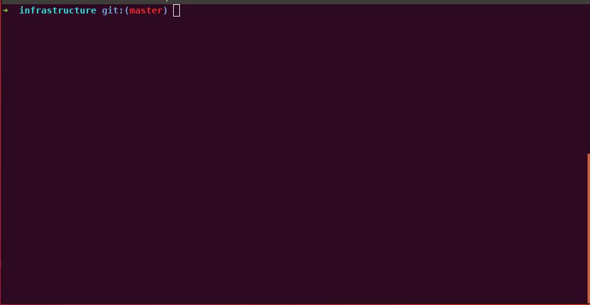
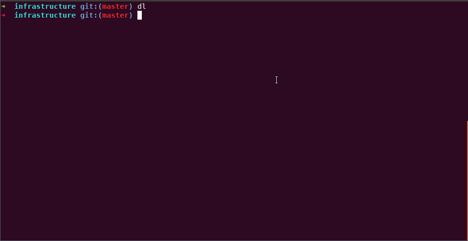
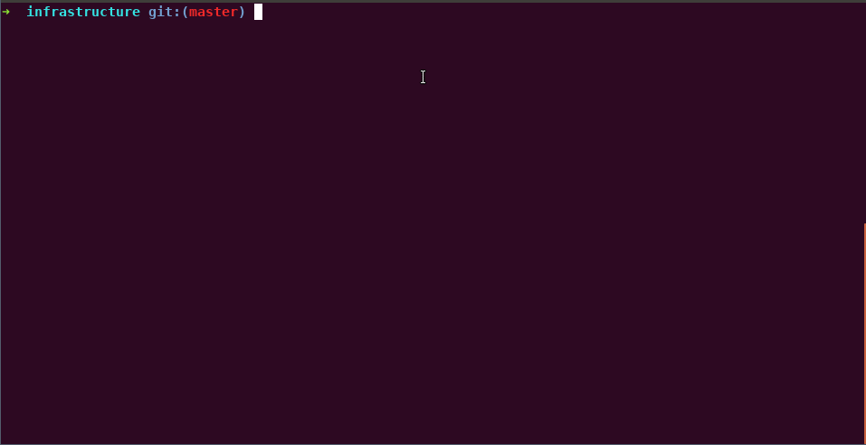

Author: MartinRamm

This is something I created to increase my productivity with docker/docker-compose.
Feel free to create a PR with improvements - but please keep this documentation up to date!

# Requirements

1. `docker` / `docker-compose` must be accessible to non-root users
1. `fzf`  (https://github.com/junegunn/fzf#installation)

# Installation instructions

1. Clone this repository: `git clone https://github.com/MartinRamm/fzf-docker.git`
1. Add to your `.zshrc` or `.bashrc` file this command: `source /path/to/docker-fzf`

# Overview of available commands

| command | description                                               | fzf mode | command arguments (optional)                                                                                 |
| ------- | --------------------------------------------------------- | -------- | ------------------------------------------------------------------------------------------------------------ |
| dr      | docker restart && open logs (in follow mode)              | single   |                                                                                                              |
| dl      | docker logs (in follow mode)                              | single   | time interval - e.g.: `1m` for 1 minute - (defaults to all available logs)                                   |
| de      | docker exec in interactive mode                           | single   | command to exec (default `zsh || bash || ash || sh`)                                                         |
| ds      | docker stop                                               | multiple |                                                                                                              |
| dsa     | docker stop all running containers                        |          |                                                                                                              |
| dk      | docker kill and remove                                    | multiple |                                                                                                              |
| dka     | docker kill and remove all containers                     |          |                                                                                                              |
| drm     | docker remove container (with force)                      | multiple |                                                                                                              |
| drma    | docker remove all containers (with force)                 |          |                                                                                                              |
| drmi    | docker remove image (with force)                          | multiple |                                                                                                              |
| drmia   | docker remove all images (with force)                     |          |                                                                                                              |
| dclean  | `dka` and `drmia`                                         |          |                                                                                                              |
| dcu     | docker-compose up (in detached mode)                      | multiple | path to docker-compose file (defaults to recursive search for `docker-compose.yml` or `docker-compose.yaml`) |
| dcua    | docker-compose up all services (in detached mode)         | multiple | path to docker-compose file (defaults to recursive search for `docker-compose.yml` or `docker-compose.yaml`) |

# Learning by doing
### fzf mode = single
The image below shows a user opening the logs of the `infrastructure_php_1_6714fd704177` container with the `dl` command.
The command `dl` was entered into a terminal. The user now typed `php` to narrow the search for containers that contain that phrase. When the correct container was selected, the user pressed `Enter`.
Alternatively, the user could have used the arrow keys to select the correct container id.

### optional command arguments
This image does the same as above, but with `10m` as an argument. Therefore the command will only show the logs the selected container produced in the last 10 minutes.

### fzf mode = multiple

The image below shows a user starting the container `whiteboard` and `redis` with the `dcu` command.
To mark a containers/services in fzf, press on the `tab` key. To deselect, press `shift + tab`.
To remove the input, press `Alt + Backspace`.
Finally, press `Enter` to start the command. Note that when pressing `Enter`, the selected item will *not* be added automatically to your selection.
If you only want to mark one container, you don't have to select it with tab - you can follow the instuctions of fzf mode single.

# License
This is free and unencumbered software released into the public domain.

Anyone is free to copy, modify, publish, use, compile, sell, or
distribute this software, either in source code form or as a compiled
binary, for any purpose, commercial or non-commercial, and by any
means.

In jurisdictions that recognize copyright laws, the author or authors
of this software dedicate any and all copyright interest in the
software to the public domain. We make this dedication for the benefit
of the public at large and to the detriment of our heirs and
successors. We intend this dedication to be an overt act of
relinquishment in perpetuity of all present and future rights to this
software under copyright law.

THE SOFTWARE IS PROVIDED "AS IS", WITHOUT WARRANTY OF ANY KIND,
EXPRESS OR IMPLIED, INCLUDING BUT NOT LIMITED TO THE WARRANTIES OF
MERCHANTABILITY, FITNESS FOR A PARTICULAR PURPOSE AND NONINFRINGEMENT.
IN NO EVENT SHALL THE AUTHORS BE LIABLE FOR ANY CLAIM, DAMAGES OR
OTHER LIABILITY, WHETHER IN AN ACTION OF CONTRACT, TORT OR OTHERWISE,
ARISING FROM, OUT OF OR IN CONNECTION WITH THE SOFTWARE OR THE USE OR
OTHER DEALINGS IN THE SOFTWARE.

For more information, please refer to <http://unlicense.org>
